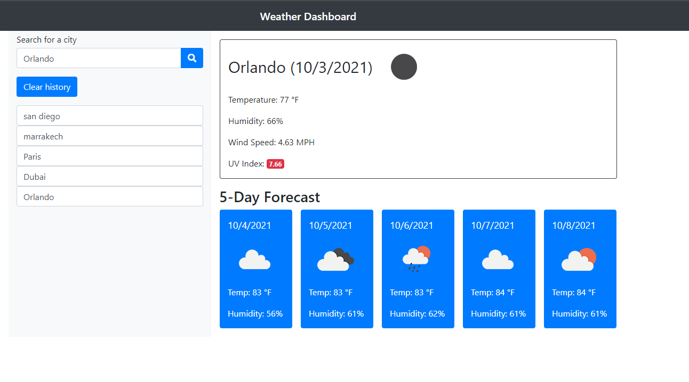

# Weather Dashboard ⛅:

### Created a dashboard that uses the OpenWeather API to retrieve weather data for cities that are searched for by user. Uses localStorage to store any cities that have been searched, and allows user to call them up quickly.

## Screenshot:

## Deployed web site: 
[Weather Dashboard](https://lazrekm.github.io/weather-dashboard/)

